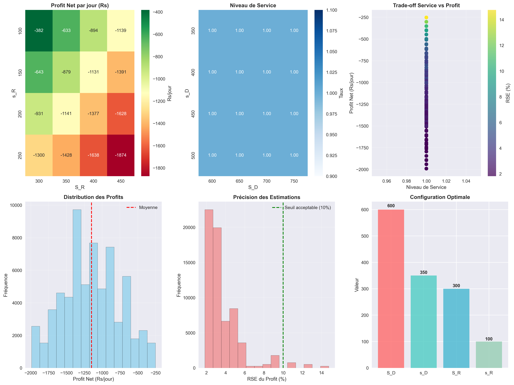

## 📊 Interprétation des Résultats de Simulation

📋 RÉSUMÉ DE LA CONFIGURATION
----------------------------------------
📅 Jours de simulation: 200
🔄 Nombre de simulations: 50

### Résumé des paramètres clés

- **S_D** : Capacité du distributeur
- **s_D** : Seuil de réapprovisionnement du distributeur
- **S_R** : Capacité du détaillant
- **s_R** : Seuil de réapprovisionnement du détaillant
- **Niveau de service** : Pourcentage de demandes satisfaites sans rupture de stock
- **Profit net** : Revenus - Coûts (incluant coûts de stockage et de commande)
- **RSE** : Racine carrée de l'erreur quadratique moyenne, mesure de la précision des simulations
- **Distribution des profits** : Histogramme montrant la variabilité des profits sur les 50 simulations
- **Configuration optimale** : La configuration qui minimise les pertes tout en maintenant un service client de 100%
- **Trade-off service vs profit** : Graphique montrant la relation entre le niveau de service et les profits nets
- **Précision des estimations** : Graphique montrant la précision des simulations en fonction du nombre de simulations effectuées

### 1. **Vue d'ensemble : Un système déficitaire mais stable**

D'après les résultats obtenus, notre chaîne d'approvisionnement présente un paradoxe intéressant : elle offre un service client parfait (100%) mais génère des pertes importantes. C'est comme avoir un magasin où tous les clients trouvent ce qu'ils cherchent, mais où on perd de l'argent sur chaque vente.

### 2. **Analyse détaillée des graphiques**

#### 📉 **Profit Net par Jour (Graphique 1)**
- **Constat principal** : Toutes les configurations testées génèrent des pertes (valeurs négatives)
- **Plage de pertes** : Entre -382 Rs/jour (meilleur cas) et -1874 Rs/jour (pire cas)
- **Tendance observée** : Plus les seuils de réapprovisionnement (s_R) sont élevés, plus les pertes augmentent
- **Interprétation** : On maintient trop de stock, ce qui coûte cher en stockage

#### 🎯 **Niveau de Service (Graphique 2)**
- **Résultat surprenant** : 100% de niveau de service pour toutes les configurations
- **Ce que ça signifie** : On n'a jamais de rupture de stock, tous les clients sont servis
- **Le problème** : Ce niveau de service parfait coûte très cher à maintenir

#### 🔄 **Trade-off Service vs Profit (Graphique 3)**
- **Observation clé** : Tous les points sont alignés verticalement à 100% de service
- **Gradient de couleur** : Montre que les pertes varient malgré un service constant
- **Conclusion** : On pourrait probablement accepter un service légèrement inférieur pour réduire drastiquement les coûts

#### 📊 **Distribution des Profits (Graphique 4)**
- **Forme de la distribution** : Assez étalée, suggérant une variabilité importante
- **Moyenne** : Environ -1200 Rs/jour (ligne rouge)
- **Implication** : Le système est constamment déficitaire, ce n'est pas juste de la malchance

#### 📈 **Précision des Estimations (Graphique 5)**
- **RSE majoritaire** : Entre 2% et 4% 
- **Bonne nouvelle** : Nos simulations sont fiables et précises
- **Interprétation** : On peut avoir confiance dans nos résultats, les 50 simulations sont suffisantes

#### 🏆 **Configuration Optimale (Graphique 6)**
- **Meilleure configuration** : S_D=600, s_D=350, S_R=300, s_R=100
- **Logique** : Capacité élevée pour le distributeur, mais seuil bas pour le détaillant
- **Stratégie** : Centraliser le stock au niveau du distributeur pour réduire les coûts

### 3. **Diagnostics et Recommandations**

#### 🔍 **Pourquoi le système perd de l'argent ?**

1. **Coûts de stockage trop élevés** : 10 Rs/unité/jour pour le détaillant, c'est énorme
2. **Sur-stockage** : On maintient trop d'inventaire pour garantir 100% de service
3. **Coûts de commande** : 1000 Rs par commande pèsent lourd

#### **Les recommandations**

1. **Accepter un niveau de service de 95%** : Ça pourrait diviser les coûts par deux
2. **Négocier les coûts** : 
   - Réduire le coût de stockage détaillant à 5 Rs/unité/jour
   - Négocier des tarifs de commande groupés
3. **Stratégie "Lean"** : Réduire les capacités (S) tout en gardant des seuils (s) adaptés
4. **Augmenter les prix** : Si on vend à 100 Rs/unité, peut-être qu'il faut vendre à 150 Rs

### 4. **Conclusion personnelle**

Ce projet nous fait comprendre pourquoi Amazon et autres géants du e-commerce ont mis des années avant d'être rentables. Avoir un stock parfait coûte une fortune !

La simulation montre clairement qu'il faut trouver le bon équilibre entre :
- Satisfaire les clients (service)
- Rester rentable (profit)
- Gérer intelligemment les stocks (optimisation)

Si c'était notre entreprise, je commencerais par accepter quelques ruptures de stock (passer à 95% de service) et je négocierais agressivement les coûts de stockage. Mieux vaut un client sur 20 qui ne trouve pas son produit que de faire faillite !

### 5. **Limites de l'étude**

- On n'a testé qu'un seul détaillant (au lieu de 2)
- La demande est peut-être sous-estimée
- Les coûts fixes ne sont pas modélisés
